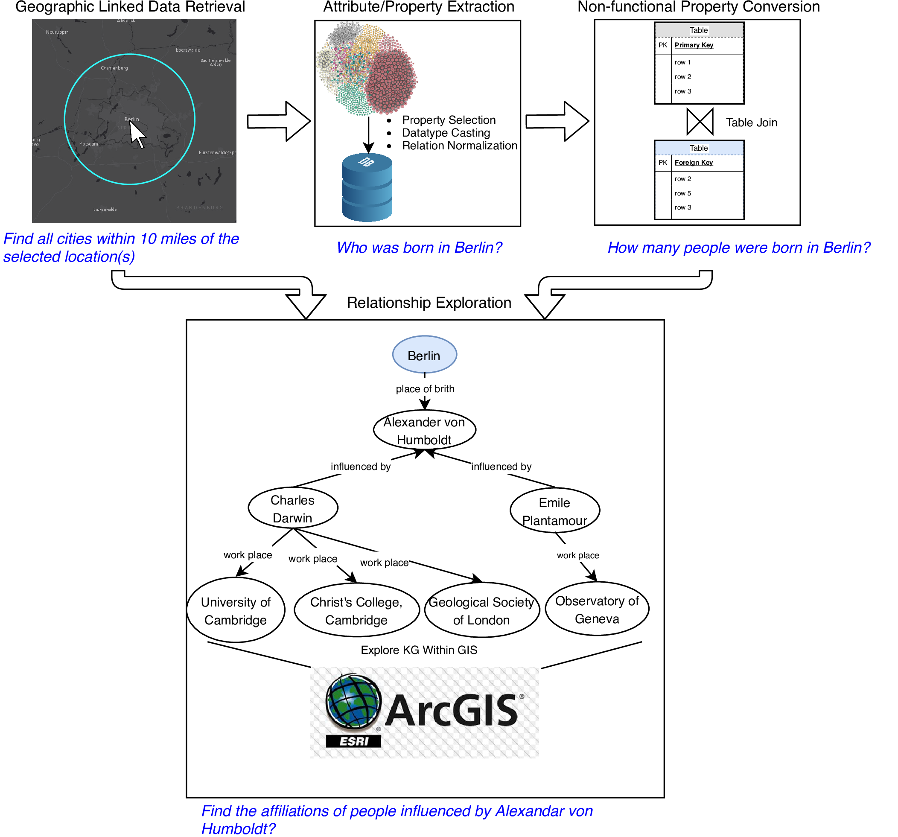

#  Deeply Integrating Linked Data with Geographic Information Systems
Code for ESRI Linked Data Connector Tools described in [our Transactions in GIS paper](https://onlinelibrary.wiley.com/doi/abs/10.1111/tgis.12538).

## Flowchart of ESRI Linked Data Connector
<p align="center">
  
</p>

### Related Link
1. [Transactions in GIS Paper](https://onlinelibrary.wiley.com/doi/abs/10.1111/tgis.12538)
2. [Projection Demo](https://www.youtube.com/watch?v=kluiPMaNHfM)
3. [Esri UC 2020 Presentation Slides](http://www.geog.ucsb.edu/~gengchen_mai/presentations/2019-EsriUC2019.pdf)

### Dependencies
- ArcGIS Desktop 10.4
- Python 2.7
- requests 2.18.1+


### Code Usage
This ArcPy toolbox is implemented in Python 2.7 for ArcGIS Desktop 10.4+. Please make sure to install [requests](https://requests.readthedocs.io/en/master/) before use this toolbox.


### Reference
If you find our work useful in your research please consider citing our paper.  
```
@article{mai2019deeply,
  title={Deeply Integrating Linked Data with Geographic Information Systems},
  author={Mai, Gengchen and Janowicz, Krzysztof and Yan, Bo and Scheider, Simon},
  journal={Transactions in GIS},
  volume={23},
  number={3},
  pages={579--600},
  year={2019},
  doi = {DOI:10.1111/tgis.12538},
  publisher={Wiley Online Library}
}
```
